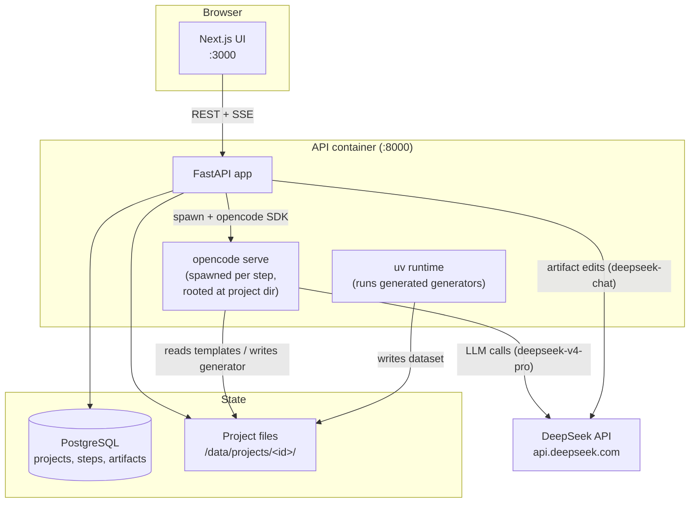
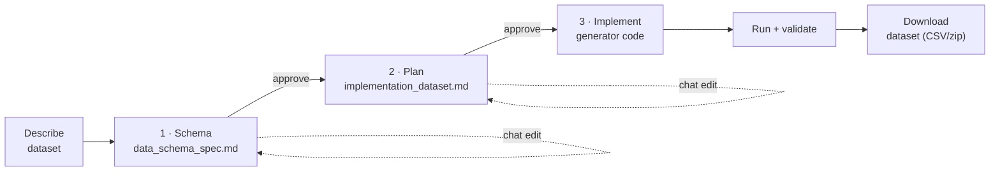
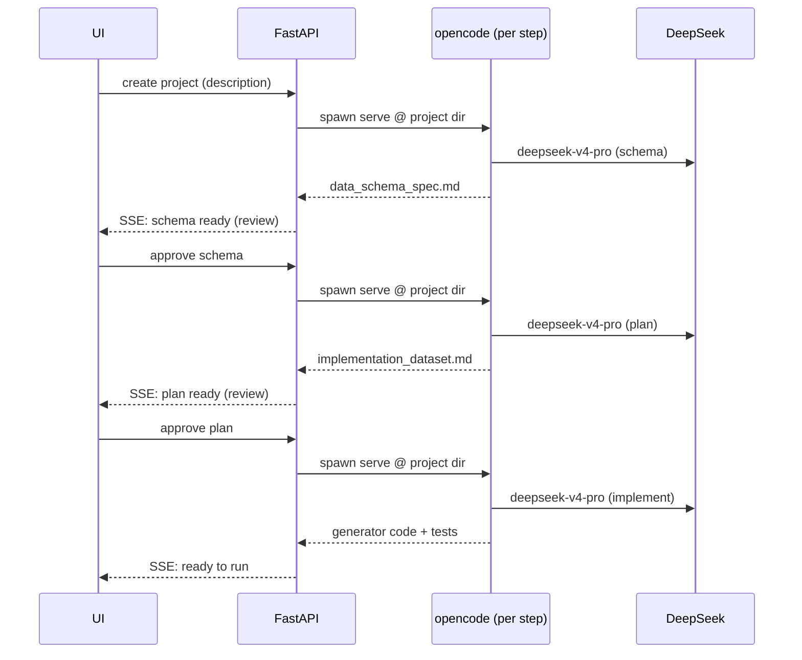

# AI Data Factory

> Describe a dataset in plain English → get a **reusable, validated synthetic-data generator** — not just a one-off CSV.

AI Data Factory is a web platform that turns a natural-language dataset
description into a fully functional Python **generator**: parameterized,
seeded, validated, and re-runnable. An agent pipeline (**opencode + DeepSeek**)
designs the schema, picks a generation strategy, writes the generator code,
runs it, and validates the output — with a human review gate at each step.

The key idea: most synthetic-data tools emit data. This one emits the
**generator** — so you get reproducibility (seeds), scale (1K or 10M rows),
version control, and customization for free.

---

## Table of contents

- [Features](#features)
- [Architecture](#architecture)
- [How the pipeline works](#how-the-pipeline-works)
- [Generation strategies](#generation-strategies)
- [Tech stack](#tech-stack)
- [Quick start (reproduce)](#quick-start-reproduce)
- [Usage](#usage)
- [Configuration](#configuration)
- [Models](#models)
- [Project structure](#project-structure)
- [Local development](#local-development)
- [Notes & roadmap](#notes--roadmap)

---

## Features

- 🧠 **Natural-language → generator code.** Describe the dataset; the agent designs and implements it.
- 🔁 **Reusable artifact.** The output is a CLI generator you re-run with different record counts, seeds, and locales.
- 🪜 **Human-in-the-loop.** Approve the schema, then the plan, then let it code — errors are caught cheaply before the expensive step.
- 🎛️ **Cost-aware strategies.** Uses plain Faker when possible, an LLM only where free-text/semantic consistency is needed.
- ✅ **Validation built in.** Generated code ships with statistical/structural validators.
- 🐳 **Self-contained deploy.** One Docker/Podman command; the opencode binary is baked into the image. Only a `DEEPSEEK_API_KEY` is required.
- 📡 **Live streaming.** Each step streams progress to the UI over Server-Sent Events.

---

## Architecture



**Isolation model.** opencode does not scope its file tools by session — they
operate in the directory the server was started in. So for each pipeline step
the backend spawns a short-lived `opencode serve` **rooted at that project's
directory**, runs one agentic turn, and tears it down. One isolated server per
step (~1–2 s startup, negligible vs. multi-minute generation).

---

## How the pipeline works



Each step is backed by a command template in `.claude/commands/` (reused
verbatim as the agent prompt — edit a template, change behavior for every
future project, no redeploy):

| Step | Template | What the agent does |
|------|----------|---------------------|
| **Schema** | `generate-schema.md` | Reads your description → writes `data_schema_spec.md` (fields, constraints, correlations) |
| **Plan** | `generate-plan.md` | Picks a strategy + writes `implementation_dataset.md` (the technical plan) |
| **Implement** | `implement.md` | Writes the full generator (code, config, validators, tests), runs it, validates |

The **"Chat with the AI"** on the schema/plan review pages edits the artifact in
place via DeepSeek directly (streamed), returning the updated markdown + a diff.



---

## Generation strategies

The plan step picks one, matching cost/quality to the dataset:

| Strategy | When | LLM use |
|----------|------|---------|
| `faker_pure` | All structured fields, no free text | None — fastest/cheapest |
| `faker_llm` | Mostly structured + some free-text/classification | LLM enriches text fields only |
| `llm` | Deep semantic consistency across fields | LLM generates structured batches |
| `data_driven` | A real CSV exists in `data/` | Fits patterns from real data |

> **Have real data?** Upload a CSV when creating a project and the platform
> profiles it (pandas/scipy) and builds a generator that statistically matches
> it. See **[docs/DATA_DRIVEN.md](docs/DATA_DRIVEN.md)** for the full flow.

---

## Tech stack

| Layer | Tech |
|-------|------|
| Frontend | Next.js (React), Tailwind, Server-Sent Events |
| Backend | FastAPI (Python ≥ 3.13), SQLAlchemy, Alembic |
| AI engine | **opencode** (headless) + **opencode Python SDK** |
| LLM | **DeepSeek** — `deepseek-v4-pro` (generation), `deepseek-chat` (edits) |
| Generator runtime | `uv`, Faker, optional `openai` lib → DeepSeek |
| State | PostgreSQL; project files on a volume |
| Packaging | Docker / Podman + Compose |

---

## Quick start (reproduce)

### Prerequisites

- **Podman + podman-compose** (or **Docker + Docker Compose**)
- A **DeepSeek API key** → https://platform.deepseek.com

### Steps

```bash
# 1. Clone
git clone git@github.com:calasius/ai-data-factory.git
cd ai-data-factory

# 2. Configure
cp .env.example .env
# edit .env and set:
#   DEEPSEEK_API_KEY=sk-...
# (for local access, NEXT_PUBLIC_API_URL=http://localhost:8000)

# 3. Build & run (Podman)
podman compose up --build -d
#   …or Docker:
# docker compose up --build -d
```

Then open:

| Service | URL |
|---------|-----|
| Web UI | http://localhost:3000 |
| API | http://localhost:8000 (`/health`) |

> The first build takes a few minutes (it installs the opencode binary, `uv`,
> Python deps, and compiles the Next.js app). Subsequent `up` is instant.

### Useful commands

```bash
podman compose logs -f api     # live API logs
podman compose ps              # service status
podman compose restart api     # restart just the API
podman compose down            # stop everything
podman compose up -d           # start again (no rebuild)
podman compose up --build -d   # rebuild after code changes
```

---

## Usage

1. Open http://localhost:3000 → **New project**.
2. Paste a dataset description (example below).
3. **Schema** is generated → review, optionally "Chat with the AI" to tweak → **Approve**.
4. **Plan** is generated → review/tweak → **Approve**.
5. **Implement** writes the generator, runs it, and validates.
6. **Run** with your record count / seed / locale → **download** the dataset.

### Example dataset description

```markdown
# Support tickets — e-commerce retailer

Synthetic dataset of customer-support tickets for an online retail store
(locale en_US). ~2000 tickets.

## Expected fields
- ticket_id, opened_at, closed_at
- customer (name, email, US city)
- channel: web / chat / email / phone
- category: shipping, return, payment, defective_product, inquiry
- product and product_category
- priority: low / medium / high / urgent
- status: open / in_progress / resolved / closed
- issue_description (free text)
- resolution (free text)
- resolution_time_hours
- csat_score (1 to 5)

## Correlations and rules
- Priority depends on category (defective_product/payment skew high/urgent).
- Resolution time scales inversely with priority; varies by channel.
- CSAT correlates negatively with resolution time.
- closed_at exists only when status is resolved or closed.
- issue_description and resolution must be consistent with the category.
```

This lands in the `faker_llm` strategy — a good showcase of structured fields +
LLM-enriched text + correlations.

---

## Configuration

Set in `.env` (see `.env.example`):

| Variable | Default | Purpose |
|----------|---------|---------|
| `DEEPSEEK_API_KEY` | — (**required**) | DeepSeek API key |
| `DEEPSEEK_MODEL` | `deepseek-v4-pro` | Model for schema/plan/code generation |
| `DEEPSEEK_EDIT_MODEL` | `deepseek-chat` | Model for artifact (chat) edits |
| `OPENCODE_CONFIG_PATH` | `/app/api/opencode.json` | opencode provider config |
| `PROJECTS_DIR` | `/data/projects` | Where project files live |
| `DATABASE_URL` | postgres… | PostgreSQL connection |
| `NEXT_PUBLIC_API_URL` | `http://localhost:8000` | API URL baked into the web build |

The DeepSeek provider (base URL, model list) is declared in
[`api/opencode.json`](api/opencode.json); the API key is injected via
`{env:DEEPSEEK_API_KEY}`.

---

## Models

| Task | Model | Path |
|------|-------|------|
| Generate code (`/implement`), schema, plan | `deepseek-v4-pro` | opencode |
| Edit schema/plan (chat) | `deepseek-chat` | DeepSeek API (direct) |
| LLM inside generated generators (runtime) | `deepseek-chat` (recommended) | `openai` lib → DeepSeek |

Change the generation model via `DEEPSEEK_MODEL` (e.g. `deepseek-v4-flash` for
cheaper/faster).

---

## Project structure

```
api/                    FastAPI backend
  main.py               app + lifespan
  config.py             settings (env-driven)
  routers/              projects, runs, jobs endpoints
  services/
    opencode_service.py opencode + DeepSeek generation engine
    llm_service.py      DeepSeek direct (artifact edits)
    runner_service.py   runs the generated generators (uv)
    file_service.py     project dirs, template symlinks, zips
    sse.py              in-process Server-Sent Events
  opencode.json         opencode DeepSeek provider config
.claude/commands/       agent command templates (schema/plan/implement)
tools/templates/        strategy templates (faker_pure / faker_llm / llm / data_driven)
web/                    Next.js frontend
docker/                 Dockerfiles + entrypoint
docker-compose.yml      postgres, redis, api, web
```

---

## Local development

The supported path is the containerized stack above. To iterate on the
frontend alone:

```bash
cd web
npm install
npm run dev        # http://localhost:3000 (point NEXT_PUBLIC_API_URL at the API)
```

The backend expects a running opencode binary on `PATH`, a PostgreSQL
instance, and `DEEPSEEK_API_KEY` in the environment — easiest via the compose
stack.

---

## Notes & roadmap

- **Sweet spot:** realistic test/demo/staging data in minutes (the `faker_llm`
  lane), rather than privacy-grade statistical fidelity.
- **Highest-value next steps:** deepen `data_driven` (fit to an uploaded CSV)
  and ship validators that *prove* realism (distribution, cardinality, and
  correlation checks) — the most defensible differentiator.
- `redis` and the `worker` service are scaffolding for future background jobs;
  SSE is currently in-process.

---

🤖 Built with an opencode + DeepSeek agent pipeline.
