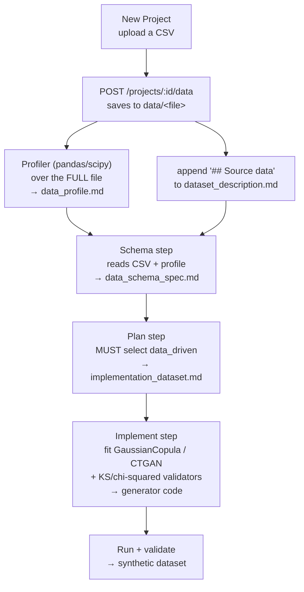

# Data-driven flow — "I have data, generate more like it"

This document describes the **data-driven** flow end to end: upload a real CSV,
and the platform profiles it, infers its schema, and builds a generator that
produces synthetic data **statistically matching** the source (distributions,
correlations, categorical proportions) — instead of plausible-but-made-up data.

It complements the LLM/Faker flows (`faker_pure`, `faker_llm`, `llm`), which
generate from a natural-language description alone.

---

## When to use it

Use data-driven when you already have a representative sample and want **more of
the same shape** — for testing, ML training, staging, or sharing a non-sensitive
stand-in for real data. If you only have an idea (no real file), use the
description-based flow instead.

---

## End-to-end flow



The key design choice: **statistics are computed by deterministic code
(pandas/scipy) over the full file, not by an LLM reading a truncated sample.**
The agents then *consume* that profile. This is what makes the output
statistically faithful rather than merely plausible.

---

## Step 1 — Upload

In the UI (**New Project**), provide a name and optionally a description, then
**upload a CSV**. When a CSV is attached the description is optional — it's
auto-derived from the file.

Under the hood:

`POST /projects/{id}/data` (multipart, field `file`)

1. Saves the file to `data/<filename>` inside the project directory
   (`file_service.save_data_file`, filename sanitized).
2. Runs the **profiler** (best-effort) → writes `data_profile.md`.
3. Appends a `## Source data` block to `dataset_description.md` pointing at the
   CSV and the profile, which steers the pipeline into `data_driven`.

Response: `{ "status": "uploaded", "path": "data/<file>", "size": <bytes>, "profile": "data_profile.md" }`

> Best-effort: if profiling fails, the CSV is still saved and usable — you just
> won't get a precomputed `data_profile.md`.

---

## Step 2 — Profiling (`data_profile.md`)

`api/services/profile_service.py` reads the **entire** CSV with pandas and emits
a human-readable `data_profile.md`. Per column:

- **dtype**, **% null**, **cardinality** (unique count)
- **numeric**: min / max / mean / std / p25 / p50 / p75, plus the **best-fit
  distribution** chosen by lowest KS statistic among
  `norm, lognorm, expon, gamma, uniform` (via `scipy.stats`)
- **categorical**: top-k value frequencies (with %)
- **datetime**: detected range (min → max)
- **numeric correlations**: strongest Pearson pairs with `|r| ≥ 0.3`, and a hint
  to prefer a correlation-preserving model when correlations are strong

Example (excerpt):

```
### `amount` — numeric, 0.0% null, 199 unique
  - min=6.8 max=226.9 mean=113.3 std=57.96 p25=68.03 p50=109.7 p75=160.9
  - best-fit: `lognorm(...)` (KS=0.068)

## Numeric correlations (|r| ≥ 0.3)
- `amount` ~ `qty`: r=0.97
Strong correlations → prefer GaussianCopula / CopulaGAN / CTGAN.
```

This file becomes input to the schema, plan, and implement steps.

---

## Step 3 — Schema

The schema agent reads `dataset_description.md` (which now references the CSV and
`data_profile.md`) and produces `data_schema_spec.md` grounded in the **real**
columns, dtypes, ranges, and distributions — not guesses.

---

## Step 4 — Plan (strategy selection)

`.claude/commands/generate-plan.md` enforces a **deterministic** choice:

> 1. **If a real source file exists in `data/` → you MUST use `data_driven`.**
>    Read `data_profile.md`; use its dtypes, fitted distributions, and
>    correlations to choose the algorithm, set distribution parameters, and
>    define KS / chi-squared validation targets. Never fall back to
>    faker_*/llm when `data/` has a source file.
> 2. Otherwise pick by field types (faker_pure / faker_llm / llm).

The result is written to `implementation_dataset.md`. The `data_driven` strategy
template (`tools/templates/strategy_data_driven.md`) guides the agent to:

- Profile-driven algorithm choice:
  - **Statistical sampling** — independent per-column resampling
  - **GaussianCopula** (SDV) — preserves linear correlations
  - **CTGAN / TVAE / CopulaGAN** — non-linear correlations / complex distributions
- Persist the fitted model for reproducibility
- Validate with **Kolmogorov–Smirnov** per numeric column + **chi-squared** on
  categoricals

---

## Step 5 — Implement & run

The implement step writes the full generator (code, config, validators, tests),
fits the chosen model to `data/<file>`, and runs it. Running the generator
produces the synthetic dataset; the validator checks it against the source's
distributions (KS / chi-squared targets from the profile).

If the strategy includes free-text enrichment (`faker_llm`-style phase 2), the
generated generator calls **DeepSeek** via the `openai` library — see
[LLM provider](#llm-provider).

---

## Files in the project directory

```
<project>/
├── data/<file>.csv          # uploaded source (triggers data_driven)
├── data_profile.md          # precomputed pandas/scipy profile
├── dataset_description.md    # description + "## Source data" note
├── data_schema_spec.md       # schema grounded in the real data
├── implementation_dataset.md # the plan (strategy = data_driven)
├── generation_config.yaml    # run config (num_records, seed, locale, output)
├── src/ tests/ seeds/ config/ # the generated generator
└── output/<run_id>/          # generated datasets per run
```

---

## LLM provider

Generators that need LLM enrichment use **DeepSeek** (OpenAI-compatible), via the
`openai` library — never Azure or Anthropic:

```python
import os
from openai import OpenAI
client = OpenAI(base_url="https://api.deepseek.com", api_key=os.environ["DEEPSEEK_API_KEY"])
resp = client.chat.completions.create(
    model=os.environ.get("DEEPSEEK_MODEL", "deepseek-chat"),
    messages=[...],
)
```

Use JSON mode (`response_format={"type": "json_object"}`) and validate the parsed
JSON — DeepSeek does not support OpenAI strict structured outputs. Always include
a deterministic rules-based fallback for offline runs.

> Pure `data_driven` is statistical and usually needs no LLM at all; the provider
> matters only when the plan adds an enrichment phase.

---

## How failures are handled (robustness)

The agent steps are resilient by design:

- **Inline-output salvage** — if an agent returns the artifact as a chat reply
  instead of writing the file, `opencode_service._salvage` recovers it from the
  assistant's text (assistant-only, substantial markdown) and writes the file.
- **Error propagation** — if the schema or plan step fails, the project status is
  set to `error` (it no longer hangs in `*_running`), and the step's `output`
  carries the error message (visible via the API / UI).

---

## Limitations & notes

- **Single-table.** One uploaded CSV → one table. Multi-table data-driven
  (related CSVs with foreign keys) is not yet supported.
- **Datetime detection** in the profiler is heuristic; some date columns may be
  reported as categorical (cosmetic — the schema/agent still handle them).
- The profiler is **best-effort**: failures degrade gracefully.
- Dependencies: the API image includes `pandas` and `scipy` for profiling.

---

## Quick API walkthrough

```bash
# 1. Create the project
PID=$(curl -s -X POST $API/projects -H 'content-type: application/json' \
  -d '{"name":"my-data","description":""}' | jq -r .id)

# 2. Upload the source CSV → profiles + steers to data_driven
curl -s -X POST "$API/projects/$PID/data" -F "file=@/path/to/source.csv"

# 3. Start the pipeline (schema → review → plan → review → implement)
curl -s -X POST "$API/projects/$PID/pipeline/start"
# …approve schema, approve plan via the UI or the approve endpoints…

# 4. Run the generator (after status = ready) and download the dataset
```
